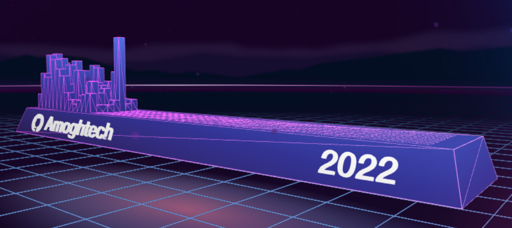

### Hi there, I'm Amogh Nagar 

## I'm a Student !!

- 🌱 I’m currently learning Flutter and DSA
- 👯 I’m looking to collaborate with other content creators
- 🥅 2021 Goals: Contribute more to Open Source projects

### My stats

  
  

### Connect with me:

<a href="https://discord.gg/probablyamogh">
  

<a href="https://www.linkedin.com/in/amogh-nagar-09ab341ab/">
  
 

### Languages and Tools:

  
  
  
  
 

---

 

  
  
 

<iframe src="https://giphy.com/embed/h408T6Y5GfmXBKW62l" width="480" height="426" frameBorder="0" class="giphy-embed" allowFullScreen></iframe>
 

[twitter]: https://twitter.com/amogh_nagar
[instagram]: https://instagram.com/probablyamogh
[linkedin]: https://linkedin.com/in/AmoghNagar
